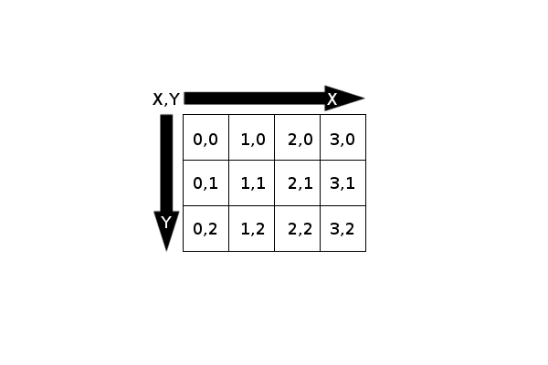

## Imágenes

El principal elemento en un juego son las imágenes. Usamos imágenes para los fondos y decorados, para los objetos estáticos o dinámicos, para los personajes o elementos de juego, para el interfaz...

Para **Pygame**, una imagen no es más que un rectángulo formado por puntos de color llamados "*pixels*".

Por ejemplo, aquí debajo puedes ver la fotografía de un gato y, a su derecha, el detalle ampliado de una pequeña zona de la imagen (marcada en el original con un cuadrado):


Aunque **Pygame** usa este sistema, en realidad esta no es la única forma posible de representar imágenes, pero sí que es la más utilizada. Es así, por ejemplo, en los típicos formatos de imagen GIF, PNG o JPG. Este tipo de formato de imagen es lo que se conoce como un "mapa de bits" o "bitmap".

**Pygame** usa para manejar imágenes el objeto `surface`, que consiste básicamente en un formato de imagen (de _bitmap_, como hemos visto) interno. Para crear tus imágenes puedes usar el programa gráfico que quieras, porque **Pygame** permite importar los formatos de mapa de bits más usuales. Concretamente, los formatos de imagen soportados por **Pygame** son BMP, GIF, JPG, LBM, PBM, PCX, PGM, PNG, PPM, TGA, TIF y XPM.

Para cargar nuestras imágenes tenemos `pygame.image.load()`, que importa un archivo de imagen a **Pygame** de este modo:

```
imagen= pygame.image.load("ruta/al/archivo/de/imagen.jpg")
```

Esto crea un objeto `surface` que podremos usar en nuestro juego.

El efecto contrario (guardar una `surface` a un archivo) se hace mediante `pygame.image.save()`, que se usa del siguiente modo:

```
pygame.image.load(imagen,"ruta/al/archivo/de/imagen.jpg")
```

> El método `save` sólo soporta los formatos BMP, TGA, PNG y JPG.

Para posicionar un gráfico en pantalla de la Ventana (que es en sí misma una `surface`), usaremos el método `blit` pasándole como parámetros la imagen (otra `surface`) que queremos cargar y una tupla con sus coordenadas.

> Lo que hace `blit`, en realidad, es pegar unas imágenes en otras. En nuestro caso, sobre "ventana". De este modo, lo que estamos haciendo es crear una sola imagen para, posteriormente, dibujar todo de una sola vez.
> Esto acelera el redibujado de gráficos y mejora el rendimiento, además de aprovechar algunas capacidades de aceleración por hardware. [Ver más acerca de la técnica del blitting](http://es.wikipedia.org/wiki/Bit_blit)

```
ventana.blit(Fondo, (0, 0))
```

Para referenciar a un pixel concreto (por ejemplo, indicar la posición donde se hace un `blit`), **Pygame** usa sus coordenadas.

Las coordenadas se miden en pixels desde la esquina superior izquierda de la pantalla (o de la imagen sobre las que las midamos), e indican dónde se ubicará la esquina superior izquierda de la imagen.

La primera coordenada de la tupla es el eje X (horizontal) y la segunda es el eje Y (vertical), como se puede ver en este esquema:



Respecto al eje Z (es decir, la profundidad: qué imágenes se dibujarán encima de cuáles), las imágenes se muestran en el orden en el que se ubican con `blit`, de modo que las últimas se mostrarán *sobre* las anteriores.

Sólo posicionar las imágenes **no las muestra**. Hace falta indicarle a **Pygame** que debe redibujarlas, para lo que tenemos la instrucción `pygame.display.flip()`, que actualiza la ventana completa y se usa de este modo:

```
pygame.display.flip()
```

Vamos a ver cómo funciona todo esto junto:

Para los siguientes ejemplos vamos a usar una imagen de fondo que es obra de [Lil-Mz](http://www.deviantart.com/morelikethis/125969509) y se distribuye con una licencia Creative Commons BySA que permite su reutilización.


También usaremos una pequeña imagen con el logo de la [Oficina de Softwre libre de la Universidad de Granada](http://osl.ugr.es)


> Nota que estamos usando una imagen JPG y otra PNG indistintamente, **Pygame** se ocupa de ello por nosotros.

Veamos el ejemplo ahora:

```
#!/usr/bin/env python
# -*- coding: utf-8 -*-

# Importamos la librería
import pygame

import sys

# Importamos constantes locales de pygame
from pygame.locals import *

# Iniciamos Pygame
pygame.init()

# Creamos una surface (la ventana de juego), asignándole un alto y un ancho
Ventana = pygame.display.set_mode((600, 400))

# Le ponemos un título a la ventana
pygame.display.set_caption("Poniendo Imágenes")

# Cargamos las imágenes
fondo = pygame.image.load("fondo.jpg")
imagen = pygame.image.load("imagen.png")
# posiciona las imágenes en Ventana
ventana.blit(fondo, (0, 0))
ventana.blit(imagen, (300, 200))
# refresca los gráficos
pygame.display.flip()

# Bucle infinito para mantener el programa en ejecución
while True:

    # Manejador de eventos
    for evento in pygame.event.get():
        # Pulsación de la tecla escape
        if evento.type == pygame.KEYDOWN and evento.key == pygame.K_ESCAPE:
                sys.exit()
```

Hemos elegido deliberadamente una imagen en formato PNG porque este formato admite transparencia (el formato JPG, en cambio, no soporta transparencias).

Hacerlo así nos simplificará el trabajo, aunque **Pygame** nos permite asignar un color como transparente, usando el método `set_colorkey()`.

La forma más usual de hacer esto es tomar el color de la esquina superior derecha de la imagen (las coordenadas 0,0) con el `método get_at()` y usar ese color como transparente, de un modo parecido a esto:

```
transparente = mi_imagen.get_at((0, 0))
mi_imagen.set_colorkey(transparente)
```

Para que esto funcione es necesario que la imagen tenga un color de fondo uniforme y que, además, ese color no se use en el resto de la imagen (porque esa parte también se vería transparente).

Puedes usar esta imagen en formato GIF para practicar:


Un método interesante es `subsurface()`, que permite extraer una imagen (objeto surface) como parte de otra. Es decir, crea una imagen a partir de un "recorte" de otra mayor. Se usa de este modo:

```
imagen_trozo = imagen_completa.subsurface(rectangulo)
```

donde "rectangulo" es un objeto `rectangle` del que más adelante veremos un poco más pero que, para lo que nos interesa ahora, es una tupla con las coordenadas del rectángulo que recortaremos para crear nuestra nueva imagen. por ejemplo:

```
rectangulo = (0,0,29,81)
```
Esto nos va a ser muy útil para almacenar varias imágenes relacionadas en un sólo archivo, en particular cuando veamos cómo animar sprites.

> La clase surface nos provee de muchas más herramientas para manipular imágenes. Puedes ver más sobre ello [en su página oficial](http://www.pygame.org/docs/ref/surface.html).
